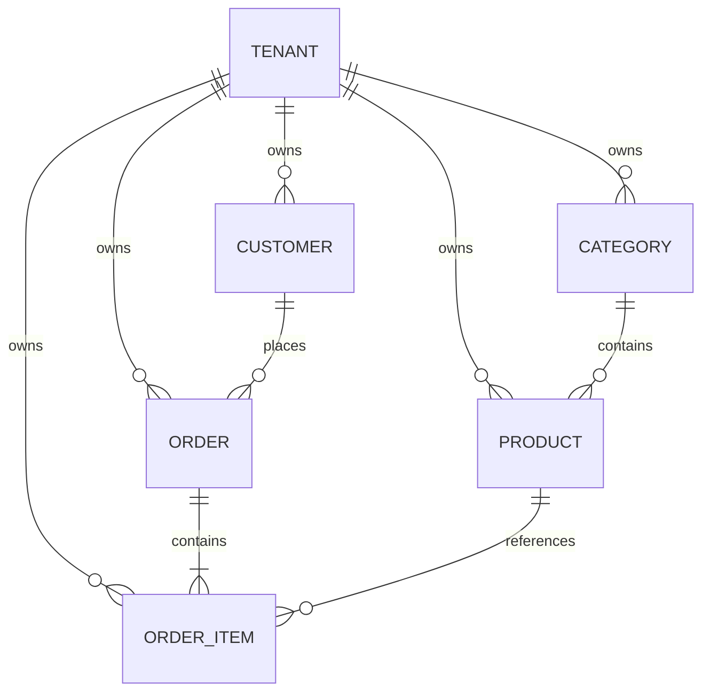

# MiniShop Interview Project

MiniShop is a compact full-stack order-management project built for a three-year-experience interview. The working source is in this repository; this document explains how to run it, where important code lives, and what to discuss.

## Stack

- .NET 10 controller-based Web API
- EF Core 10 with Oracle `MySql.EntityFrameworkCore`
- MySQL 8.4 in Docker
- ASP.NET Core Identity with GUID user/role keys
- JWT bearer authentication and Admin/User authorization
- Angular 22 standalone components
- PrimeNG 22 with Aura theme and PrimeIcons
- xUnit tests

Oracle's provider is used because its stable 10.x release supports EF Core 10. Pomelo's stable provider was still on EF Core 9 when this project was created.

## Business model

The application has six business tables. Identity adds its own framework tables. `Tenant` represents a brand, and the remaining five tables contain tenant-owned data.

All business tables use `long` primary and foreign keys, which map to MySQL `bigint`. Identity user and role keys remain `Guid`. Pagination, stock, and order quantities remain `int` because those values have much smaller practical limits.



- `Tenants`: unique code, brand name, and active state.
- `Categories`: tenant-specific unique name.
- `Products`: category FK, tenant-specific unique SKU, price, stock, active flag.
- `Customers`: tenant-specific unique email.
- `Orders`: customer FK, tenant-specific unique order number, status, server-calculated total.
- `OrderItems`: order/product FKs, quantity, captured unit price, unique order/product pair.

Parent deletion is restricted when a category, customer, or product is referenced. Deleting an order cascades to its owned items.

## Solution layout

```text
backend/src/
  MiniShop.Domain.Shared/
    Authorization/Roles.cs
    MultiTenancy/IMultiTenant.cs
    Orders/OrderStatus.cs
    Validation/ValidationConstants.cs
  MiniShop.Domain/
    Users/ApplicationUser.cs
    Tenants/Tenant.cs
    Categories/Category.cs
    Products/Product.cs
    Customers/Customer.cs
    Orders/Order.cs
    OrderItems/OrderItem.cs
  MiniShop.Application.Contracts/
    Paging/                      PagedRequest and PagedResult
    Auth/                        authentication request/response DTOs
    Categories/                  category request/response DTOs
    Products/                    product request/response DTOs
    Customers/                   customer request/response DTOs
    Orders/ and OrderItems/      order request/response DTOs
  MiniShop.Application/
    Auth/                        interfaces, registration, login and JWT code
    Exceptions/                  simple business exception classes
    Categories/                  interface, queries and CRUD service
    Products/                    interface, filtering, projection and CRUD service
    Customers/                   interface, filtering, projection and CRUD service
    Orders/                      interface, Include/ThenInclude and business rules
  MiniShop.EntityFrameworkCore/
    Configurations/              one EF mapping per entity
    Seeding/DatabaseSeeder.cs
    Migrations/
    MiniShopDbContext.cs         normal Identity-aware EF Core DbContext
  MiniShop.HttpApi/
    Controllers/                 one controller per resource
    Program.cs                   executable composition root
backend/tests/
  MiniShop.Application.Tests/    tests grouped by feature
  MiniShop.IntegrationTests/     API plus real MySQL Testcontainer
frontend/minishop-ui/src/app/
  core/
    services/                    one API service per resource
    auth.service.ts              signal-based session state
    auth.interceptor.ts          bearer token handling
    auth.guards.ts               authenticated/Admin route guards
  models/                        one TypeScript model per file plus barrel
  features/
    auth/login/ and register/    component class and separate HTML template
    catalog/
    dashboard/
    categories/
    products/
    customers/
    orders/order-list/
    orders/order-edit/           nested OrderItems form
frontend/minishop-ui/src/environments/
  environment.ts                production API URL
  environment.local.ts          local development API URL
```

`Application.Contracts` contains DTOs only. Each application-service interface is kept beside its implementation in the matching `Application` feature folder; there is no generic `Abstractions` folder. Controllers depend on these interfaces, while the implementations inject the concrete `MiniShopDbContext`. The project still avoids repository and Unit of Work wrappers. `Application` contains LINQ filtering, projections, navigation loading, validation and CRUD orchestration. `EntityFrameworkCore` contains the DbContext, mappings, migrations, Identity setup and seed data. The five tenant-owned entities implement only `IMultiTenant`; `MiniShopDbContext` reads the signed `tenant_id` claim directly and automatically applies a fail-closed global query filter to every implementing entity.

Dependency flow:

```text
Angular → Controller → Application service interface → implementation
        → MiniShopDbContext → MySQL → DTO response
```

List endpoints use `AsNoTracking` and `Select` projections. Order detail uses `Include(Customer)` plus `Include(Items).ThenInclude(Product)`. Order create/update runs in a transaction and recalculates totals from database product prices.

## Prerequisites

```powershell
dotnet --version
node --version
npm --version
docker --version
```

Expected major versions are .NET 10, Node 22.22.3+ or 24.15+, Angular 22, and Docker Desktop. Restore dependencies after cloning:

```powershell
dotnet restore MiniShop.sln
dotnet tool restore
Set-Location frontend/minishop-ui
npm install
Set-Location ../..
```

## Angular environment configuration

The frontend reads `API_BASE_URL` from an Angular environment file instead of hard-coding the API address in a service. Create the environment folder and files from `frontend/minishop-ui`:

```powershell
New-Item -ItemType Directory -Force src/environments
New-Item -ItemType File -Force src/environments/environment.ts
New-Item -ItemType File -Force src/environments/environment.local.ts
```

Put this in `src/environments/environment.ts`. Production uses a relative URL so the UI and API can be hosted behind the same domain:

```typescript
export const environment = {
  production: true,
  API_BASE_URL: '/api',
} as const;
```

Put this in `src/environments/environment.local.ts`:

```typescript
export const environment = {
  production: false,
  API_BASE_URL: 'http://localhost:5080/api',
} as const;
```

Read it in `src/app/core/api.constants.ts`:

```typescript
import { environment } from '../../environments/environment';

export const API_BASE_URL = environment.API_BASE_URL;
```

In `angular.json`, add this to the `build.configurations.development` object:

```json
"fileReplacements": [
  {
    "replace": "src/environments/environment.ts",
    "with": "src/environments/environment.local.ts"
  }
]
```

`npm start` uses `environment.local.ts`, so API calls go to `http://localhost:5080/api`. `npm run build` uses `environment.ts`. Restart `npm start` after changing an environment file.

## Run from zero

Start MySQL. Port `3308` is intentionally used to avoid common local MySQL conflicts.

```powershell
docker compose up -d
docker compose ps
```

The committed migrations are applied and demo data is seeded when the API starts. `InitialCreate` creates the schema, `UseLongBusinessKeys` upgrades business keys to MySQL `bigint`, and `AddMultiTenancy` creates the brands, backfills existing data to MiniShop, and adds tenant filters/indexes:

```powershell
dotnet run --project backend/src/MiniShop.HttpApi --launch-profile http
```

API and Swagger: `http://localhost:5080/swagger`

In another terminal:

```powershell
Set-Location frontend/minishop-ui
npm start
```

Angular: `http://localhost:4200`

### PrimeNG 22 license key

PrimeNG 22 uses the PrimeUI license model. Request a Community key for eligible personal/interview use, or use your organization's Commercial key, then paste it into `frontend/minishop-ui/src/app/primeui-license.ts`. Until a valid key is supplied, PrimeNG intentionally displays an **Invalid PrimeUI License** notice. Do not hide that notice with CSS. If a license key is not acceptable for the interview, use the last MIT-licensed PrimeNG major instead, but that would no longer satisfy this project's PrimeNG 22 requirement.

Development Admin:

```text
Brand: MiniShop
Email: admin@minishop.local
Password: Admin@12345

Brand: NovaMart
Email: admin@novamart.local
Password: Admin@12345
```

Registering through the UI creates a `User`. A User can browse the catalog but cannot access Admin APIs. The seed password, JWT key, and Compose passwords are development-only.

## API endpoints

| Method | Route | Access |
|---|---|---|
| GET | `/api/auth/tenants` | Anonymous |
| POST | `/api/auth/register` | Anonymous |
| POST | `/api/auth/login` | Anonymous |
| GET | `/api/auth/me` | Authenticated |
| GET | `/api/categories` | Authenticated |
| POST/PUT/DELETE | `/api/categories` | Admin |
| GET | `/api/products` | Authenticated |
| POST/PUT/DELETE | `/api/products` | Admin |
| All CRUD | `/api/customers` | Admin |
| All CRUD | `/api/orders` | Admin |

The JWT validates signature, issuer, audience, and lifetime. It contains subject, name, email, role, `tenant_id`, `tenant_name`, JTI, issued-at, and expiry claims. Angular stores it in `sessionStorage`, attaches it with a functional interceptor, and clears it on logout or a 401 response. The DbContext uses the signed tenant claim for automatic read isolation and validates tenant ownership during writes. API authorization—not the Angular guard—is the security boundary.

## Migrations

Create a migration after changing entity mappings:

```powershell
dotnet ef migrations add DescribeChange --project backend/src/MiniShop.EntityFrameworkCore --startup-project backend/src/MiniShop.HttpApi --output-dir Migrations
```

Apply without starting the API:

```powershell
dotnet ef database update --project backend/src/MiniShop.EntityFrameworkCore --startup-project backend/src/MiniShop.HttpApi
```

## Build and test

```powershell
dotnet build MiniShop.sln
dotnet test MiniShop.sln

Set-Location frontend/minishop-ui
npm test -- --watch=false
npm run build
```

The UI production build uses lazy-loaded feature routes to keep PrimeNG page code out of the initial bundle.

`MiniShop.IntegrationTests` starts an isolated MySQL 8.4 container, applies the real EF migration and seed, logs in through the HTTP API, and reads the projected product page. Docker must be running for that test.

## Quick API verification

```powershell
$login = Invoke-RestMethod -Method Post -Uri "http://localhost:5080/api/auth/login" `
  -ContentType "application/json" `
  -Body (@{ tenantCode="minishop"; email="admin@minishop.local"; password="Admin@12345" } | ConvertTo-Json)

$headers = @{ Authorization = "Bearer $($login.accessToken)" }
Invoke-RestMethod -Uri "http://localhost:5080/api/products?page=1&pageSize=10&search=mouse" -Headers $headers
```

In Swagger, call login, copy `accessToken`, select **Authorize**, and paste only the token.

## Interview walkthrough

1. Show the five entities and their navigation properties.
2. Show indexes and delete behavior in `MiniShopDbContext`.
3. Compare the product `Select` projection with the order `Include/ThenInclude` graph query.
4. Explain that DTOs prevent over-posting and that server code controls unit prices and totals.
5. Create an order in Angular and show its customer/items/products in Swagger.
6. Register a User and demonstrate 403 on an Admin API; omit the token to demonstrate 401.
7. Show the transaction and tests.

Useful explanations:

- `401` means authentication is missing/invalid; `403` means identity is valid but lacks the role.
- Unique database indexes enforce invariants even when two requests race.
- `AsNoTracking` reduces read-only query overhead.
- Owned order items cascade; shared reference data is protected with restrict deletes.
- Angular signals are sufficient for this small auth state, so NgRx would add unnecessary code.

## Deliberate production limitations

- Self-issued password JWT and browser storage are acceptable only for this demo. Production should use OIDC/OAuth or a backend-for-frontend with secure HttpOnly cookies.
- Add email confirmation, password reset, MFA, rate limiting, audit logs, secret/key rotation, and refresh-token strategy for production.
- Stock is validated but not reserved/decremented; real inventory needs concurrency and reservation rules.
- Confirmed financial orders should normally be immutable rather than replaced during editing.
- Customer/product selects load at most 100 records; large systems need server autocomplete.

## Troubleshooting

```powershell
docker compose ps
docker compose logs mysql
dotnet list backend/src/MiniShop.EntityFrameworkCore package
dotnet ef migrations list --project backend/src/MiniShop.EntityFrameworkCore --startup-project backend/src/MiniShop.HttpApi
```

- MySQL connection failure: confirm the container is healthy and port 3308 is free.
- Angular CORS error: the UI must run on `http://localhost:4200` and API on `http://localhost:5080`.
- Reset demo data: `docker compose down --volumes`, then start Compose and the API again. This permanently removes only this project's Docker volume.
- An attempted delete returning 409 usually means the row is referenced, which is intentional.

## Completion checklist

- [ ] `docker compose ps` reports MySQL healthy.
- [ ] Backend build and tests pass.
- [ ] Angular tests and production build pass.
- [ ] Admin login works and Swagger accepts the JWT.
- [ ] MiniShop and NovaMart logins show different isolated catalogs.
- [ ] User reads succeed; User writes return 403.
- [ ] Product paging/search works.
- [ ] Category, Product, Customer, and Order CRUD work.
- [ ] Order detail returns customer, items, and products.
- [ ] Duplicate order products and excessive quantities are rejected.
