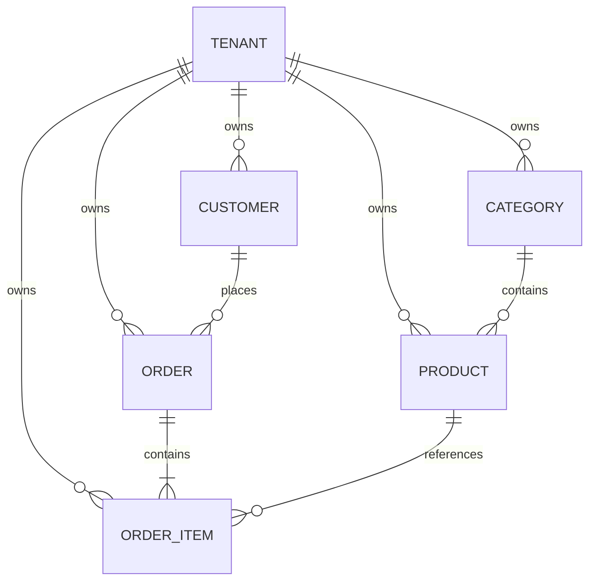

# MiniShop Interview Project

MiniShop is a compact full-stack order-management project built for a three-year-experience interview. The working source is in this repository; this document explains how to run it, where important code lives, and what to discuss.

## Stack

- .NET 10 controller-based Web API
- EF Core 10 with Oracle `MySql.EntityFrameworkCore`
- MySQL 8.4 in Docker
- ASP.NET Core Identity with GUID user/role keys
- JWT bearer authentication and Admin/User authorization
- Angular 22 standalone components
- PrimeNG 22 with Aura theme and PrimeIcons
- xUnit tests

Oracle's provider is used because its stable 10.x release supports EF Core 10. Pomelo's stable provider was still on EF Core 9 when this project was created.

## Business model

The application has six business tables. Identity adds its own framework tables. `Tenant` represents a brand, and the remaining five tables contain tenant-owned data.

All business tables use `long` primary and foreign keys, which map to MySQL `bigint`. Identity user and role keys remain `Guid`. Pagination, stock, and order quantities remain `int` because those values have much smaller practical limits.



- `Tenants`: unique code, brand name, and active state.
- `Categories`: tenant-specific unique name.
- `Products`: category FK, tenant-specific unique SKU, price, stock, active flag.
- `Customers`: tenant-specific unique email.
- `Orders`: customer FK, tenant-specific unique order number, status, server-calculated total.
- `OrderItems`: order/product FKs, quantity, captured unit price, unique order/product pair.

Parent deletion is restricted when a category, customer, or product is referenced. Deleting an order cascades to its owned items.

## Solution layout

```text
backend/src/
  MiniShop.Domain.Shared/
    Authorization/Roles.cs
    MultiTenancy/IMultiTenant.cs
    Orders/OrderStatus.cs
    Validation/ValidationConstants.cs
  MiniShop.Domain/
    Users/ApplicationUser.cs
    Tenants/Tenant.cs
    Categories/Category.cs
    Products/Product.cs
    Customers/Customer.cs
    Orders/Order.cs
    OrderItems/OrderItem.cs
  MiniShop.Application.Contracts/
    Paging/                      PagedRequest and PagedResult
    Auth/                        authentication request/response DTOs
    Categories/                  category request/response DTOs
    Products/                    product request/response DTOs
    Customers/                   customer request/response DTOs
    Orders/ and OrderItems/      order request/response DTOs
  MiniShop.Application/
    Auth/                        interfaces, registration, login and JWT code
    Exceptions/                  simple business exception classes
    Categories/                  interface, queries and CRUD service
    Products/                    interface, filtering, projection and CRUD service
    Customers/                   interface, filtering, projection and CRUD service
    Orders/                      interface, Include/ThenInclude and business rules
  MiniShop.EntityFrameworkCore/
    Configurations/              one EF mapping per entity
    Seeding/DatabaseSeeder.cs
    Migrations/
    MiniShopDbContext.cs         normal Identity-aware EF Core DbContext
  MiniShop.HttpApi/
    Controllers/                 one controller per resource
    Program.cs                   executable composition root
backend/tests/
  MiniShop.Application.Tests/    tests grouped by feature
  MiniShop.IntegrationTests/     API plus real MySQL Testcontainer
frontend/minishop-ui/src/app/
  core/
    services/                    one API service per resource
    auth.service.ts              signal-based session state
    auth.interceptor.ts          bearer token handling
    auth.guards.ts               authenticated/Admin route guards
  models/                        one TypeScript model per file plus barrel
  features/
    auth/login/ and register/    component class and separate HTML template
    catalog/
    dashboard/
    categories/
    products/
    customers/
    orders/order-list/
    orders/order-edit/           nested OrderItems form
frontend/minishop-ui/src/environments/
  environment.ts                production API URL
  environment.local.ts          local development API URL
```

`Application.Contracts` contains DTOs only. Each application-service interface is kept beside its implementation in the matching `Application` feature folder; there is no generic `Abstractions` folder. Controllers depend on these interfaces, while the implementations inject the concrete `MiniShopDbContext`. The project still avoids repository and Unit of Work wrappers. `Application` contains LINQ filtering, projections, navigation loading, validation and CRUD orchestration. `EntityFrameworkCore` contains the DbContext, mappings, migrations, Identity setup and seed data. The five tenant-owned entities implement only `IMultiTenant`; `MiniShopDbContext` reads the signed `tenant_id` claim directly and automatically applies a fail-closed global query filter to every implementing entity.

Dependency flow:

```text
Angular → Controller → Application service interface → implementation
        → MiniShopDbContext → MySQL → DTO response
```

List endpoints use `AsNoTracking` and `Select` projections. Order detail uses `Include(Customer)` plus `Include(Items).ThenInclude(Product)`. Order create/update runs in a transaction and recalculates totals from database product prices.

## Prerequisites

```powershell
dotnet --version
node --version
npm --version
docker --version
```

Expected major versions are .NET 10, Node 22.22.3+ or 24.15+, Angular 22, and Docker Desktop. Restore dependencies after cloning:

```powershell
dotnet restore MiniShop.sln
dotnet tool restore
Set-Location frontend/minishop-ui
npm install
Set-Location ../..
```

## Create the complete project from an empty folder

This section is for explaining or rebuilding the project from zero. If you cloned this repository, skip to **Run from zero** because these projects and files already exist.

### 1. Create the root folder and .NET solution

```powershell
New-Item -ItemType Directory -Force MiniShop
Set-Location MiniShop

dotnet new globaljson --sdk-version 10.0.203 --roll-forward latestPatch
dotnet new sln --name MiniShop --format sln

New-Item -ItemType Directory -Force backend/src
New-Item -ItemType Directory -Force backend/tests
```

### 2. Create the backend projects

```powershell
dotnet new classlib -n MiniShop.Domain.Shared -o backend/src/MiniShop.Domain.Shared -f net10.0
dotnet new classlib -n MiniShop.Domain -o backend/src/MiniShop.Domain -f net10.0
dotnet new classlib -n MiniShop.Application.Contracts -o backend/src/MiniShop.Application.Contracts -f net10.0
dotnet new classlib -n MiniShop.Application -o backend/src/MiniShop.Application -f net10.0
dotnet new classlib -n MiniShop.EntityFrameworkCore -o backend/src/MiniShop.EntityFrameworkCore -f net10.0
dotnet new webapi -n MiniShop.HttpApi -o backend/src/MiniShop.HttpApi -f net10.0 --use-controllers

dotnet new xunit -n MiniShop.Application.Tests -o backend/tests/MiniShop.Application.Tests -f net10.0
dotnet new xunit -n MiniShop.IntegrationTests -o backend/tests/MiniShop.IntegrationTests -f net10.0
```

Delete the generated sample files such as `Class1.cs`, `WeatherForecast.cs`, and the sample WeatherForecast controller. Then add every project to the solution:

```powershell
dotnet sln MiniShop.sln add backend/src/MiniShop.Domain.Shared/MiniShop.Domain.Shared.csproj
dotnet sln MiniShop.sln add backend/src/MiniShop.Domain/MiniShop.Domain.csproj
dotnet sln MiniShop.sln add backend/src/MiniShop.Application.Contracts/MiniShop.Application.Contracts.csproj
dotnet sln MiniShop.sln add backend/src/MiniShop.Application/MiniShop.Application.csproj
dotnet sln MiniShop.sln add backend/src/MiniShop.EntityFrameworkCore/MiniShop.EntityFrameworkCore.csproj
dotnet sln MiniShop.sln add backend/src/MiniShop.HttpApi/MiniShop.HttpApi.csproj
dotnet sln MiniShop.sln add backend/tests/MiniShop.Application.Tests/MiniShop.Application.Tests.csproj
dotnet sln MiniShop.sln add backend/tests/MiniShop.IntegrationTests/MiniShop.IntegrationTests.csproj
```

### 3. Add backend project references

The references enforce the dependency direction shown earlier:

```powershell
dotnet add backend/src/MiniShop.Domain/MiniShop.Domain.csproj reference backend/src/MiniShop.Domain.Shared/MiniShop.Domain.Shared.csproj

dotnet add backend/src/MiniShop.Application.Contracts/MiniShop.Application.Contracts.csproj reference backend/src/MiniShop.Domain.Shared/MiniShop.Domain.Shared.csproj

dotnet add backend/src/MiniShop.EntityFrameworkCore/MiniShop.EntityFrameworkCore.csproj reference backend/src/MiniShop.Domain/MiniShop.Domain.csproj

dotnet add backend/src/MiniShop.Application/MiniShop.Application.csproj reference backend/src/MiniShop.Domain/MiniShop.Domain.csproj
dotnet add backend/src/MiniShop.Application/MiniShop.Application.csproj reference backend/src/MiniShop.Application.Contracts/MiniShop.Application.Contracts.csproj
dotnet add backend/src/MiniShop.Application/MiniShop.Application.csproj reference backend/src/MiniShop.EntityFrameworkCore/MiniShop.EntityFrameworkCore.csproj

dotnet add backend/src/MiniShop.HttpApi/MiniShop.HttpApi.csproj reference backend/src/MiniShop.Application/MiniShop.Application.csproj
dotnet add backend/src/MiniShop.HttpApi/MiniShop.HttpApi.csproj reference backend/src/MiniShop.EntityFrameworkCore/MiniShop.EntityFrameworkCore.csproj

dotnet add backend/tests/MiniShop.Application.Tests/MiniShop.Application.Tests.csproj reference backend/src/MiniShop.Application/MiniShop.Application.csproj
dotnet add backend/tests/MiniShop.IntegrationTests/MiniShop.IntegrationTests.csproj reference backend/src/MiniShop.HttpApi/MiniShop.HttpApi.csproj
```

### 4. Install backend packages and EF CLI

```powershell
dotnet add backend/src/MiniShop.EntityFrameworkCore package Microsoft.AspNetCore.Identity.EntityFrameworkCore --version 10.0.11
dotnet add backend/src/MiniShop.EntityFrameworkCore package Microsoft.EntityFrameworkCore.Design --version 10.0.11
dotnet add backend/src/MiniShop.EntityFrameworkCore package MySql.EntityFrameworkCore --version 10.0.9

dotnet add backend/src/MiniShop.Application package Microsoft.EntityFrameworkCore --version 10.0.11
dotnet add backend/src/MiniShop.Application package Microsoft.Extensions.Identity.Core --version 10.0.11
dotnet add backend/src/MiniShop.Application package System.IdentityModel.Tokens.Jwt --version 8.14.0

dotnet add backend/src/MiniShop.HttpApi package Microsoft.AspNetCore.Authentication.JwtBearer --version 10.0.11
dotnet add backend/src/MiniShop.HttpApi package Microsoft.AspNetCore.OpenApi --version 10.0.11
dotnet add backend/src/MiniShop.HttpApi package Microsoft.EntityFrameworkCore.Design --version 10.0.11
dotnet add backend/src/MiniShop.HttpApi package Swashbuckle.AspNetCore --version 10.2.3

dotnet add backend/tests/MiniShop.Application.Tests package NSubstitute --version 6.2.0
dotnet add backend/tests/MiniShop.IntegrationTests package Microsoft.AspNetCore.Mvc.Testing --version 10.0.11
dotnet add backend/tests/MiniShop.IntegrationTests package Testcontainers.MySql --version 4.14.0

dotnet new tool-manifest
dotnet tool install dotnet-ef --version 10.0.11
dotnet restore MiniShop.sln
```

`MiniShop.EntityFrameworkCore.csproj` also needs the ASP.NET shared framework because `MiniShopDbContext` reads the authenticated `tenant_id` claim through `IHttpContextAccessor`:

```xml
<ItemGroup>
  <FrameworkReference Include="Microsoft.AspNetCore.App" />
</ItemGroup>
```

### 5. Create the backend folders and files

Keep one class per file. Create the folders from the solution root:

```powershell
$folders = @(
  'backend/src/MiniShop.Domain.Shared/Authorization',
  'backend/src/MiniShop.Domain.Shared/MultiTenancy',
  'backend/src/MiniShop.Domain.Shared/Orders',
  'backend/src/MiniShop.Domain.Shared/Validation',
  'backend/src/MiniShop.Domain/Users',
  'backend/src/MiniShop.Domain/Tenants',
  'backend/src/MiniShop.Domain/Categories',
  'backend/src/MiniShop.Domain/Products',
  'backend/src/MiniShop.Domain/Customers',
  'backend/src/MiniShop.Domain/Orders',
  'backend/src/MiniShop.Domain/OrderItems',
  'backend/src/MiniShop.Application.Contracts/Auth',
  'backend/src/MiniShop.Application.Contracts/Tenants',
  'backend/src/MiniShop.Application.Contracts/Paging',
  'backend/src/MiniShop.Application.Contracts/Categories',
  'backend/src/MiniShop.Application.Contracts/Products',
  'backend/src/MiniShop.Application.Contracts/Customers',
  'backend/src/MiniShop.Application.Contracts/Orders',
  'backend/src/MiniShop.Application.Contracts/OrderItems',
  'backend/src/MiniShop.Application/Auth',
  'backend/src/MiniShop.Application/Exceptions',
  'backend/src/MiniShop.Application/Categories',
  'backend/src/MiniShop.Application/Products',
  'backend/src/MiniShop.Application/Customers',
  'backend/src/MiniShop.Application/Orders',
  'backend/src/MiniShop.EntityFrameworkCore/Configurations',
  'backend/src/MiniShop.EntityFrameworkCore/Seeding',
  'backend/src/MiniShop.HttpApi/Controllers'
)
$folders | ForEach-Object { New-Item -ItemType Directory -Force $_ }
```

Add the classes using the exact paths shown in **Solution layout**. The working repository files are the source of truth: entities go in `Domain`, DTOs in `Application.Contracts`, application interfaces and services in `Application`, EF mappings/migrations in `EntityFrameworkCore`, and controllers plus startup configuration in `HttpApi`.

### 6. Configure local secrets

The repository contains obvious demo-only defaults so it runs immediately. For your own machine, override them with user-secrets instead of committing real passwords or signing keys:

```powershell
dotnet user-secrets init --project backend/src/MiniShop.HttpApi
dotnet user-secrets set "ConnectionStrings:Default" "Server=localhost;Port=3308;Database=minishop;User=minishop;Password=YOUR_LOCAL_PASSWORD" --project backend/src/MiniShop.HttpApi
dotnet user-secrets set "Jwt:SigningKey" "replace-with-at-least-32-random-characters" --project backend/src/MiniShop.HttpApi
```

Create `docker-compose.yml` in the solution root for local MySQL:

```yaml
services:
  mysql:
    image: mysql:8.4
    container_name: minishop-mysql
    restart: unless-stopped
    environment:
      MYSQL_ROOT_PASSWORD: root_dev_password
      MYSQL_DATABASE: minishop
      MYSQL_USER: minishop
      MYSQL_PASSWORD: minishop_dev_password
    ports:
      - "3308:3306"
    volumes:
      - minishop_mysql_data:/var/lib/mysql
    healthcheck:
      test: ["CMD", "mysqladmin", "ping", "-h", "localhost", "-uroot", "-proot_dev_password"]
      interval: 5s
      timeout: 5s
      retries: 20

volumes:
  minishop_mysql_data:
```

The development connection string must use port `3308`, database `minishop`, user `minishop`, and the same development password. Real credentials must not be committed.

### 7. Create the Angular 22 application

Run this from the solution root:

```powershell
npx @angular/cli@22.1.7 new minishop-ui --directory frontend/minishop-ui --standalone --routing --style css --ssr=false --skip-git --skip-tests --package-manager npm

Set-Location frontend/minishop-ui
npm install primeng@22.1.0 @primeuix/themes@3.0.0 primeicons@8.0.0 @angular/cdk@22.1.5
```

Generate the standalone pages. `--type page` produces names such as `login.page.ts`, and `--inline-style` avoids empty CSS files:

```powershell
npx ng generate component features/auth/login --standalone --type page --inline-style --skip-tests
npx ng generate component features/auth/register --standalone --type page --inline-style --skip-tests
npx ng generate component features/catalog --standalone --type page --inline-style --skip-tests
npx ng generate component features/dashboard --standalone --type page --inline-style --skip-tests
npx ng generate component features/categories --standalone --type page --inline-style --skip-tests
npx ng generate component features/products --standalone --type page --inline-style --skip-tests
npx ng generate component features/customers --standalone --type page --inline-style --skip-tests
npx ng generate component features/orders/order-list --standalone --type page --inline-style --skip-tests
npx ng generate component features/orders/order-edit --standalone --type page --inline-style --skip-tests

npx ng generate service core/auth --skip-tests
npx ng generate service core/services/category --skip-tests
npx ng generate service core/services/product --skip-tests
npx ng generate service core/services/customer --skip-tests
npx ng generate service core/services/order --skip-tests
npx ng generate interceptor core/auth --functional
```

Create `src/app/core/auth.guards.ts`, the model files under `src/app/models`, and the environment files described in the next section. Use the existing repository files as the complete implementation rather than placing all application source inside this guide.

### 8. Configure Angular routes

Angular routing is enabled by `--routing`. `src/app/app.config.ts` must register `provideRouter(routes)`, `provideHttpClient(withInterceptors([authInterceptor]))`, animations, and PrimeNG. Define these lazy standalone routes in `src/app/app.routes.ts`:

```text
/login                  LoginPage
/register               RegisterPage
/catalog                CatalogPage              authGuard
/admin                  DashboardPage            authGuard + adminGuard
/admin/categories       CategoriesPage           authGuard + adminGuard
/admin/products         ProductsPage             authGuard + adminGuard
/admin/customers        CustomersPage            authGuard + adminGuard
/admin/orders           OrdersPage               authGuard + adminGuard
/admin/orders/new       OrderEditPage            authGuard + adminGuard
/admin/orders/:id       OrderEditPage            authGuard + adminGuard
```

Each route uses `loadComponent: () => import(...).then(...)`, which lazy-loads the page. The empty route and unknown routes redirect to `/login`.

### 9. Create the database migration

After adding the entities, `IMultiTenant`, DbContext, mappings, Identity configuration, and connection string, return to the solution root and run:

```powershell
Set-Location ../..
dotnet build MiniShop.sln
dotnet ef migrations add InitialCreate --project backend/src/MiniShop.EntityFrameworkCore --startup-project backend/src/MiniShop.HttpApi --output-dir Migrations
dotnet ef database update --project backend/src/MiniShop.EntityFrameworkCore --startup-project backend/src/MiniShop.HttpApi
```

This repository has three migrations because `long` keys and multi-tenancy were added as later interview steps. When rebuilding the final model from zero, one new `InitialCreate` migration is enough and will contain the final schema.

## Angular environment configuration

The frontend reads `API_BASE_URL` from an Angular environment file instead of hard-coding the API address in a service. Create the environment folder and files from `frontend/minishop-ui`:

```powershell
New-Item -ItemType Directory -Force src/environments
New-Item -ItemType File -Force src/environments/environment.ts
New-Item -ItemType File -Force src/environments/environment.local.ts
```

Put this in `src/environments/environment.ts`. Production uses a relative URL so the UI and API can be hosted behind the same domain:

```typescript
export const environment = {
  production: true,
  API_BASE_URL: '/api',
} as const;
```

Put this in `src/environments/environment.local.ts`:

```typescript
export const environment = {
  production: false,
  API_BASE_URL: 'http://localhost:5080/api',
} as const;
```

Read it in `src/app/core/api.constants.ts`:

```typescript
import { environment } from '../../environments/environment';

export const API_BASE_URL = environment.API_BASE_URL;
```

In `angular.json`, add this to the `build.configurations.development` object:

```json
"fileReplacements": [
  {
    "replace": "src/environments/environment.ts",
    "with": "src/environments/environment.local.ts"
  }
]
```

`npm start` uses `environment.local.ts`, so API calls go to `http://localhost:5080/api`. `npm run build` uses `environment.ts`. Restart `npm start` after changing an environment file.

## Build the minimal Angular UI and CSS step by step

The UI intentionally has only two CSS files:

- `frontend/minishop-ui/src/styles.css` contains global variables, reusable page/form classes, and a few PrimeNG sizing rules.
- `frontend/minishop-ui/src/app/app.css` contains only the authenticated sidebar shell.

Feature components use `--inline-style` when generated, so they do not create empty `.css` files. Add a feature CSS file only when that page has a real style that cannot be reused.

### 1. Enable the PrimeNG theme

In `src/app/app.config.ts`, register the Aura preset and animations:

```typescript
import { provideAnimationsAsync } from '@angular/platform-browser/animations/async';
import { providePrimeNG } from 'primeng/config';
import Aura from '@primeuix/themes/aura';

providers: [
  provideAnimationsAsync(),
  providePrimeNG({
    license: primeUiLicense,
    theme: {
      preset: Aura,
      options: { darkModeSelector: false },
    },
  }),
]
```

Keep `"styles": ["src/styles.css"]` in the Angular build options. Import PrimeIcons once at the top of `src/styles.css`:

```css
@import 'primeicons/primeicons.css';
```

Do not recreate PrimeNG buttons, tables, dialogs, selects, or inputs with custom CSS. Import the required PrimeNG module in the standalone page and use the component directly.

### 2. Add the global design values and base elements

Start `src/styles.css` with only the colors used by the application and a small reset:

```css
:root {
  color-scheme: light;
  --ink: #0f172a;
  --muted: #64748b;
  --line: #e2e8f0;
  --primary: #4f46e5;
}

* {
  box-sizing: border-box;
}

body {
  margin: 0;
  color: var(--ink);
  background: #f8fafc;
  font-family: Inter, 'Segoe UI', Arial, sans-serif;
}

button,
input {
  font: inherit;
}
```

These are element rules, so the HTML does not need classes such as `app-text`, `custom-font`, or `page-background`.

### 3. Add only reusable layout classes

The actual templates reuse the following small set:

| Class | Real use |
|---|---|
| `page-head` | Page title plus the page action/search area |
| `toolbar-actions` | Groups search and action buttons |
| `panel` | White content container around tables/forms |
| `form-grid` | Two-column order/product forms |
| `field` | Label, control, and help text stack |
| `full` | Makes one field span both form columns |
| `muted` | Secondary explanatory text |
| `actions` and `preview-total` | Order form footer and calculated preview |
| `auth-page`, `auth-card`, `auth-form`, `auth-switch` | Login and registration only |
| `product-image-preview` | Constrains the real uploaded image preview |

Example reusable rules:

```css
.page-head,
.toolbar-actions,
.actions {
  display: flex;
  align-items: center;
  gap: 0.75rem;
}

.page-head {
  justify-content: space-between;
  margin-bottom: 1.4rem;
}

.muted {
  color: var(--muted);
}

.panel {
  overflow: hidden;
  padding: 1rem;
  border: 1px solid var(--line);
  border-radius: 12px;
  background: #fff;
}

.form-grid {
  display: grid;
  grid-template-columns: repeat(2, minmax(0, 1fr));
  gap: 1rem;
}

.field {
  display: grid;
  gap: 0.4rem;
}

.full {
  grid-column: 1 / -1;
}
```

Use those classes directly in a feature template:

```html
<div class="page-head">
  <div>
    <h1>Products</h1>
    <p class="muted">Manage pricing and availability</p>
  </div>
  <div class="toolbar-actions">
    <input pInputText placeholder="Search" />
    <p-button label="New product" icon="pi pi-plus" />
  </div>
</div>

<div class="panel">
  <p-table><!-- table templates --></p-table>
</div>
```

`pi` and `pi-*` are PrimeIcons classes, while `p-button`, `p-dialog`, `p-select`, and similar classes are created by PrimeNG. They are external framework classes, not unused application classes.

### 4. Keep shell styles with the root component

`src/app/app.html` owns the sidebar, content area, mobile menu button, and backdrop. Therefore their rules stay in `src/app/app.css`, where Angular scopes them to the root component:

```css
.shell {
  min-height: 100vh;
  background: #f8fafc;
}

.shell aside {
  position: fixed;
  inset: 0 auto 0 0;
  display: flex;
  flex-direction: column;
  width: 250px;
  min-height: 100vh;
  padding: 1.5rem 1rem;
  color: #e0e7ff;
  background: #1e1b4b;
}

.content {
  min-height: 100vh;
  margin-left: 250px;
}

.content main {
  max-width: 1280px;
  margin: auto;
  padding: 2rem;
}
```

The `[class.open]="menuOpen"` binding in `app.html` is not unused: the mobile media query uses `.shell aside.open` to display the sidebar. The `active` class is also real because `routerLinkActive="active"` applies it to the current navigation link.

### 5. Add one mobile breakpoint

The form and page header collapse in global CSS, while the sidebar behavior remains in `app.css`:

```css
/* src/styles.css */
@media (max-width: 600px) {
  .form-grid {
    grid-template-columns: 1fr;
  }

  .page-head,
  .actions {
    align-items: stretch;
    flex-direction: column;
  }
}
```

```css
/* src/app/app.css */
@media (max-width: 760px) {
  .shell aside {
    transform: translateX(-100%);
  }

  .shell aside.open {
    transform: none;
  }

  .content {
    margin-left: 0;
  }

  .menu,
  .close-menu {
    display: grid;
  }

  .menu-backdrop {
    display: block;
  }
}
```

Use the complete current `styles.css` and `app.css` as the source of truth when recreating the repository; the snippets above explain the order and reason for each section.

### 6. Check for unused CSS before the interview

From the repository root, list application class attributes and custom selectors:

```powershell
rg -n 'class="|\[class\.' frontend/minishop-ui/src/app -g '*.html'
rg -n '^\.[a-zA-Z]' frontend/minishop-ui/src/styles.css frontend/minishop-ui/src/app/app.css
```

For every custom selector, find either a static `class="..."`, an Angular class binding such as `[class.open]`, or `routerLinkActive`. Remove a selector only after checking those dynamic cases. Do not remove PrimeNG or PrimeIcons selectors merely because they are absent from your own templates; those elements are rendered by the library at runtime.

## Run from zero

Start MySQL. Port `3308` is intentionally used to avoid common local MySQL conflicts.

```powershell
docker compose up -d
docker compose ps
```

The committed migrations are applied and demo data is seeded when the API starts. `InitialCreate` creates the schema, `UseLongBusinessKeys` upgrades business keys to MySQL `bigint`, and `AddMultiTenancy` creates the brands, backfills existing data to MiniShop, and adds tenant filters/indexes:

```powershell
dotnet run --project backend/src/MiniShop.HttpApi --launch-profile http
```

API and Swagger: `http://localhost:5080/swagger`

In another terminal:

```powershell
Set-Location frontend/minishop-ui
npm start
```

Angular: `http://localhost:4200`

### PrimeNG 22 license key

PrimeNG 22 uses the PrimeUI license model. Request a Community key for eligible personal/interview use, or use your organization's Commercial key, then paste it into `frontend/minishop-ui/src/app/primeui-license.ts`. Until a valid key is supplied, PrimeNG intentionally displays an **Invalid PrimeUI License** notice. Do not hide that notice with CSS. If a license key is not acceptable for the interview, use the last MIT-licensed PrimeNG major instead, but that would no longer satisfy this project's PrimeNG 22 requirement.

Development Admin:

```text
Brand: MiniShop
Email: admin@minishop.local
Password: Admin@12345

Brand: NovaMart
Email: admin@novamart.local
Password: Admin@12345
```

Registering through the UI creates a `User`. A User can browse the catalog but cannot access Admin APIs. The seed password, JWT key, and Compose passwords are development-only.

## API endpoints

| Method | Route | Access |
|---|---|---|
| GET | `/api/auth/tenants` | Anonymous |
| POST | `/api/auth/register` | Anonymous |
| POST | `/api/auth/login` | Anonymous |
| GET | `/api/auth/me` | Authenticated |
| GET | `/api/categories` | Authenticated |
| POST/PUT/DELETE | `/api/categories` | Admin |
| GET | `/api/products` | Authenticated |
| POST/PUT/DELETE | `/api/products` | Admin |
| GET | `/api/products/{productId}/image` | Authenticated |
| POST/DELETE | `/api/products/{productId}/image` | Admin |
| All CRUD | `/api/customers` | Admin |
| All CRUD | `/api/orders` | Admin |

The JWT validates signature, issuer, audience, and lifetime. It contains subject, name, email, role, `tenant_id`, `tenant_name`, JTI, issued-at, and expiry claims. Angular stores it in `sessionStorage`, attaches it with a functional interceptor, and clears it on logout or a 401 response. The DbContext uses the signed tenant claim for automatic read isolation and validates tenant ownership during writes. API authorization—not the Angular guard—is the security boundary.

## Product image upload and download

MiniShop implements product image upload without adding another business table. It keeps only the relative file path in `Products`; it does not store image bytes in MySQL. The Products page has one image action that opens a minimal upload, preview, replace, and remove dialog.

### Request flow

```text
Angular file input
  -> FormData with field name "file"
  -> POST /api/products/{productId}/image with JWT
  -> ProductImagesController calls IProductImageAppService
  -> Application validates tenant product, type, extension and size
  -> Application generates a safe unique filename and writes the file
  -> Product.ImagePath stores products/<generated-name>.webp
  -> GET /api/products/{productId}/image returns the file
```

The product lookup still passes through the DbContext tenant query filter. A user from one tenant must receive `404`, not another tenant's image. The filename sent by the browser is never trusted or reused as the stored filename.

### Backend changes

The implementation adds one nullable property to `backend/src/MiniShop.Domain/Products/Product.cs`:

```csharp
public string? ImagePath { get; set; }
```

Add its maximum length in `ProductConfiguration.Configure`:

```csharp
builder.Property(product => product.ImagePath).HasMaxLength(300);
```

The controller depends on the interface in `backend/src/MiniShop.Application/Products/IProductImageAppService.cs`:

```csharp
using Microsoft.AspNetCore.Http;

namespace MiniShop.Application;

public interface IProductImageAppService
{
    Task UploadAsync(long productId, IFormFile file, CancellationToken cancellationToken);
    Task<ProductImageResult> GetAsync(long productId, CancellationToken cancellationToken);
    Task DeleteAsync(long productId, CancellationToken cancellationToken);
}

public sealed record ProductImageResult(string FullPath, string ContentType);
```

`ProductImageAppService` is in `MiniShop.Application/Products`, beside the other product logic. Its three methods do the following:

1. Query `dbContext.Products.SingleOrDefaultAsync(product => product.Id == productId)`. The global filter automatically limits the query to the current tenant.
2. For upload, reject an empty file, a file larger than 5 MB, and anything except `.jpg`, `.jpeg`, `.png`, or `.webp`. Browser image content types are checked; generic `application/octet-stream` is accepted so PowerShell uploads work.
3. Create `uploads/products` below the API content root if it does not exist.
4. Generate the stored name with `Guid.NewGuid().ToString("N") + extension`. Never combine a client filename directly into a path.
5. Copy with `await using var stream = File.Create(fullPath); await file.CopyToAsync(stream, cancellationToken);`.
6. Store only `products/<generated-name>` in `Product.ImagePath` and call `SaveChangesAsync`.
7. For get, ensure `ImagePath` exists, resolve it below the known upload root, and return its path and content type.
8. For replacement, save the new image first, update the database, and then remove the old file. For delete, clear `ImagePath`, save the database change, and then remove the file if present.

Register it in `MiniShop.Application/DependencyInjection.cs`:

```csharp
services.AddScoped<IProductImageAppService, ProductImageAppService>();
```

The controller remains small in `backend/src/MiniShop.HttpApi/Controllers/ProductImagesController.cs`:

```csharp
using Microsoft.AspNetCore.Authorization;
using Microsoft.AspNetCore.Mvc;
using MiniShop.Application;
using MiniShop.Domain.Shared;

namespace MiniShop.HttpApi.Controllers;

[ApiController]
[Route("api/products/{productId:long}/image")]
[Authorize]
public sealed class ProductImagesController(IProductImageAppService imageAppService) : ControllerBase
{
    [HttpPost]
    [Authorize(Roles = Roles.Admin)]
    [RequestSizeLimit(5 * 1024 * 1024)]
    public async Task<IActionResult> Upload(
        long productId,
        [FromForm] IFormFile file,
        CancellationToken cancellationToken)
    {
        await imageAppService.UploadAsync(productId, file, cancellationToken);
        return NoContent();
    }

    [HttpGet]
    public async Task<IActionResult> Get(long productId, CancellationToken cancellationToken)
    {
        var image = await imageAppService.GetAsync(productId, cancellationToken);
        return PhysicalFile(image.FullPath, image.ContentType, enableRangeProcessing: true);
    }

    [HttpDelete]
    [Authorize(Roles = Roles.Admin)]
    public async Task<IActionResult> Delete(long productId, CancellationToken cancellationToken)
    {
        await imageAppService.DeleteAsync(productId, cancellationToken);
        return NoContent();
    }
}
```

Because `IFormFile` is an ASP.NET type, `MiniShop.Application.csproj` contains this framework reference:

```xml
<ItemGroup>
  <FrameworkReference Include="Microsoft.AspNetCore.App" />
</ItemGroup>
```

The included `AddProductImage` migration was created with these commands:

```powershell
dotnet ef migrations add AddProductImage `
  --project backend/src/MiniShop.EntityFrameworkCore `
  --startup-project backend/src/MiniShop.HttpApi `
  --output-dir Migrations

dotnet ef database update `
  --project backend/src/MiniShop.EntityFrameworkCore `
  --startup-project backend/src/MiniShop.HttpApi
```

### Angular upload and get calls

Add these methods to the product data service. Do not manually set the `Content-Type` header for `FormData`; the browser must add its multipart boundary.

```typescript
uploadImage(productId: number, file: File) {
  const formData = new FormData();
  formData.append('file', file);

  return this.http.post<void>(
    `${environment.apiBaseUrl}/api/products/${productId}/image`,
    formData
  );
}

getImage(productId: number) {
  return this.http.get(
    `${environment.apiBaseUrl}/api/products/${productId}/image`,
    { responseType: 'blob' }
  );
}

deleteImage(productId: number) {
  return this.http.delete<void>(
    `${environment.apiBaseUrl}/api/products/${productId}/image`
  );
}
```

The Products page uses a native file input for the minimal interview UI:

```html
<input type="file" accept="image/png,image/jpeg,image/webp" (change)="selectImage($event)" />
<p-button label="Upload" (onClick)="uploadImage()" [disabled]="!selectedImage" />
```

```typescript
selectedImage?: File;
imageUrl?: string;

selectImage(event: Event): void {
  const input = event.target as HTMLInputElement;
  this.selectedImage = input.files?.[0];
}

loadImage(productId: number): void {
  this.productService.getImage(productId).subscribe(blob => {
    if (this.imageUrl) URL.revokeObjectURL(this.imageUrl);
    this.imageUrl = URL.createObjectURL(blob);
  });
}
```

The existing JWT interceptor automatically adds the bearer token to upload, get, and delete requests. Revoke the object URL when replacing the image or destroying the component to avoid a browser memory leak.

### PowerShell verification

PowerShell 7 can send multipart form data directly:

```powershell
$headers = @{ Authorization = "Bearer $($login.accessToken)" }

Invoke-RestMethod -Method Post `
  -Uri "http://localhost:5080/api/products/1/image" `
  -Headers $headers `
  -Form @{ file = Get-Item "C:\Temp\product.webp" }

Invoke-WebRequest `
  -Uri "http://localhost:5080/api/products/1/image" `
  -Headers $headers `
  -OutFile "C:\Temp\downloaded-product.webp"

Invoke-RestMethod -Method Delete `
  -Uri "http://localhost:5080/api/products/1/image" `
  -Headers $headers
```

Expected responses are `204` for upload/delete, `200` for get, `400` for an empty or unsupported file, `404` for a missing or other-tenant product, and `413` when the complete multipart request exceeds the API request limit.

For production, use Azure Blob Storage, Amazon S3, or another object store instead of the API disk. Add malware scanning, file-signature validation, image re-encoding, private signed URLs where required, retention cleanup, and a persistent Docker volume for any local-disk deployment. The database should continue to store only the object key and metadata.

## Migrations

Create a migration after changing entity mappings:

```powershell
dotnet ef migrations add DescribeChange --project backend/src/MiniShop.EntityFrameworkCore --startup-project backend/src/MiniShop.HttpApi --output-dir Migrations
```

Apply without starting the API:

```powershell
dotnet ef database update --project backend/src/MiniShop.EntityFrameworkCore --startup-project backend/src/MiniShop.HttpApi
```

## Build and test

```powershell
dotnet build MiniShop.sln
dotnet test MiniShop.sln

Set-Location frontend/minishop-ui
npm test -- --watch=false
npm run build
```

The UI production build uses lazy-loaded feature routes to keep PrimeNG page code out of the initial bundle.

`MiniShop.IntegrationTests` starts an isolated MySQL 8.4 container, applies the real EF migration and seed, logs in through the HTTP API, and reads the projected product page. Docker must be running for that test.

## Quick API verification

```powershell
$login = Invoke-RestMethod -Method Post -Uri "http://localhost:5080/api/auth/login" `
  -ContentType "application/json" `
  -Body (@{ tenantCode="minishop"; email="admin@minishop.local"; password="Admin@12345" } | ConvertTo-Json)

$headers = @{ Authorization = "Bearer $($login.accessToken)" }
Invoke-RestMethod -Uri "http://localhost:5080/api/products?page=1&pageSize=10&search=mouse" -Headers $headers
```

In Swagger, call login, copy `accessToken`, select **Authorize**, and paste only the token.

## Interview walkthrough

1. Show the five entities and their navigation properties.
2. Show indexes and delete behavior in `MiniShopDbContext`.
3. Compare the product `Select` projection with the order `Include/ThenInclude` graph query.
4. Explain that DTOs prevent over-posting and that server code controls unit prices and totals.
5. Create an order in Angular and show its customer/items/products in Swagger.
6. Register a User and demonstrate 403 on an Admin API; omit the token to demonstrate 401.
7. Show the transaction and tests.

Useful explanations:

- `401` means authentication is missing/invalid; `403` means identity is valid but lacks the role.
- Unique database indexes enforce invariants even when two requests race.
- `AsNoTracking` reduces read-only query overhead.
- Owned order items cascade; shared reference data is protected with restrict deletes.
- Angular signals are sufficient for this small auth state, so NgRx would add unnecessary code.

## Deliberate production limitations

- Self-issued password JWT and browser storage are acceptable only for this demo. Production should use OIDC/OAuth or a backend-for-frontend with secure HttpOnly cookies.
- Add email confirmation, password reset, MFA, rate limiting, audit logs, secret/key rotation, and refresh-token strategy for production.
- Stock is validated but not reserved/decremented; real inventory needs concurrency and reservation rules.
- Confirmed financial orders should normally be immutable rather than replaced during editing.
- Customer/product selects load at most 100 records; large systems need server autocomplete.

## Troubleshooting

```powershell
docker compose ps
docker compose logs mysql
dotnet list backend/src/MiniShop.EntityFrameworkCore package
dotnet ef migrations list --project backend/src/MiniShop.EntityFrameworkCore --startup-project backend/src/MiniShop.HttpApi
```

- MySQL connection failure: confirm the container is healthy and port 3308 is free.
- Angular CORS error: the UI must run on `http://localhost:4200` and API on `http://localhost:5080`.
- Reset demo data: `docker compose down --volumes`, then start Compose and the API again. This permanently removes only this project's Docker volume.
- An attempted delete returning 409 usually means the row is referenced, which is intentional.

## Completion checklist

- [ ] `docker compose ps` reports MySQL healthy.
- [ ] Backend build and tests pass.
- [ ] Angular tests and production build pass.
- [ ] Admin login works and Swagger accepts the JWT.
- [ ] MiniShop and NovaMart logins show different isolated catalogs.
- [ ] User reads succeed; User writes return 403.
- [ ] Product paging/search works.
- [ ] Category, Product, Customer, and Order CRUD work.
- [ ] Order detail returns customer, items, and products.
- [ ] Duplicate order products and excessive quantities are rejected.
- [ ] An Admin can upload, preview, replace, and remove a product image.
